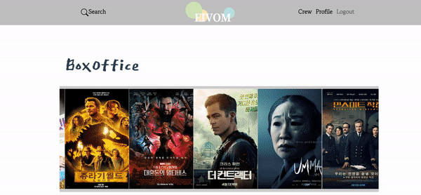
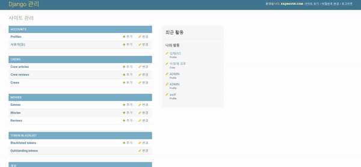

# EIVOM 이봄

## 영화인을 위한 추천 및 커뮤니티 웹사이트

#### 🤝SSAFY 상반기 최종 프로젝트 우수상

## EIVOM

MOVIE를 뒤집은 단어인 EIVOM 한국어로 이봄으로 발음되며,

- 좋아하는 영화에 대해 이야기 나누며 **깊이 봄**
- 크루 가입으로 나와 통하는 사람과 **같이 봄**

- 맞춤 추천으로 선호하는 장르의 영화를 **오롯이 봄**

이라는 의미를 담고 있습니다.

## 결과물 Preview

### 회원가입/로그인

### 프로필

#### 자신의 프로필과 좋아요 누른 영화 조회 가능

### 메인페이지(추천 리스트 구성)

- 박스오피스 상영 영화
- 영화 군집화 후 추천 
- 날씨 기반 영화 추천 
- 최근 조회수가 높은 영화
- TMDB(TheMovieDataBase) 인기 영화
- 유저의 선호 장르 기반 추천 영화  

### 영화 상세 페이지

- 영화의 상세 정보 조회
- 출연 배우 조회
  - 출연 배우 클릭시 배우의 필모그래피로 이동 
- 영화에 대한 리뷰 조회 및 생성/삭제 

### 검색기능

- 영화 검색 및 검색 결과로 이동

### 크루 페이지 (개발 진행중)

- 크루 가입, 게시글 작성 및 수정/삭제, 댓글 작성 및 수정/삭제 

 

### 관리자 페이지

- 회원 정보 관리, 영화/리뷰 정보,크루 정보 갱신 가능 

