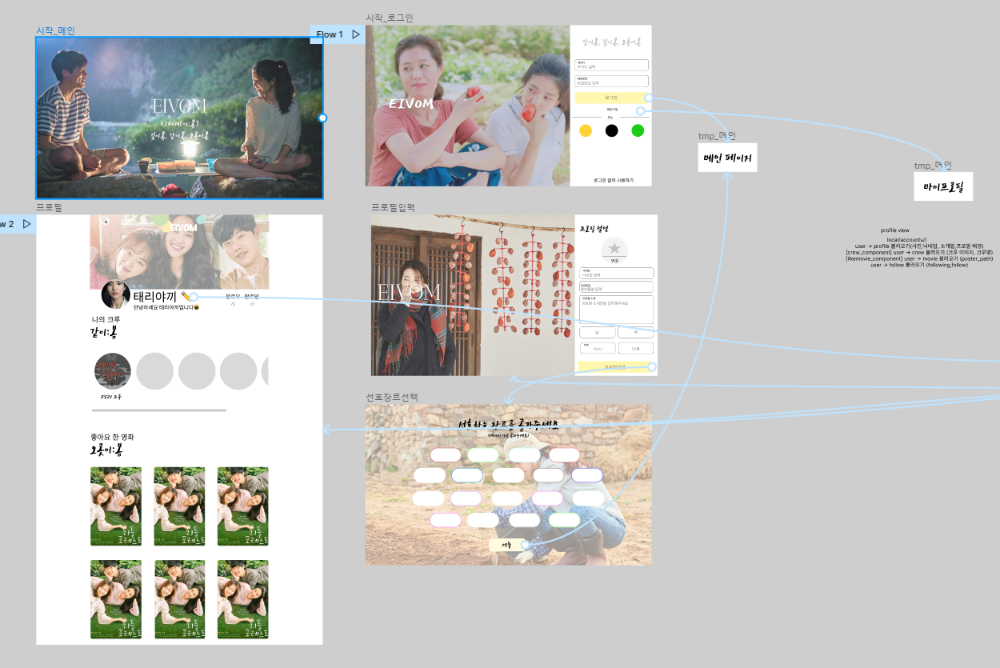
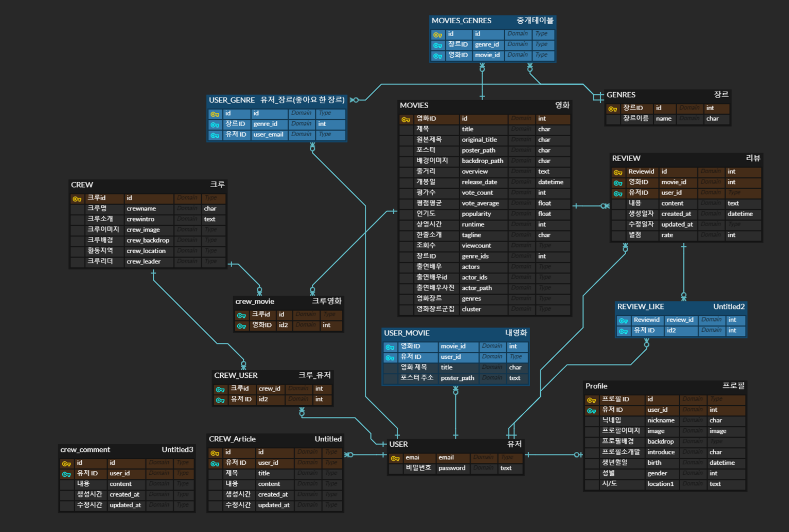

# EIVOM 이봄

## 영화인을 위한 추천 및 커뮤니티 웹사이트

#### 🤝SSAFY 상반기 최종 프로젝트 우수상


## EIVOM

MOVIE를 뒤집은 단어인 EIVOM 한국어로 이봄으로 발음되며,

- 좋아하는 영화에 대해 이야기 나누며 **깊이 봄**
- 크루 가입으로 나와 통하는 사람과 **같이 봄**

- 맞춤 추천으로 선호하는 장르의 영화를 **오롯이 봄**

이라는 의미를 담고 있습니다.

## 결과물 Preview

### 회원가입/로그인


### 프로필

#### 자신의 프로필과 좋아요 누른 영화 조회 가능


### 메인페이지(추천 리스트 구성)

- 박스오피스 상영 영화
- 영화 군집화 후 추천 
- 날씨 기반 영화 추천 
- 최근 조회수가 높은 영화
- TMDB(TheMovieDataBase) 인기 영화
- 유저의 선호 장르 기반 추천 영화  


### 영화 상세 페이지

- 영화의 상세 정보 조회
- 출연 배우 조회
  - 출연 배우 클릭시 배우의 필모그래피로 이동 
- 영화에 대한 리뷰 조회 및 생성/삭제 


### 검색기능

- 영화 검색 및 검색 결과로 이동


### 크루 페이지 (개발 진행중)

- 크루 가입, 게시글 작성 및 수정/삭제, 댓글 작성 및 수정/삭제 

 

### 관리자 페이지

- 회원 정보 관리, 영화/리뷰 정보,크루 정보 갱신 가능 


## 개발환경

### 개발도구

- Python
- Django
- HTML/CSS
- JavaScript
- Vue.js

### 목표 설정

- 설정한 커밋 양식에 맞춰 깃 커밋하기
  - FEAT : 새로운 기능의 추가
  - FIX: 버그 수정
  - DOCS: 문서 수정
  - STYLE: 스타일 관련 기능(코드 포맷팅, 세미콜론 누락, 코드 자체의 변경이 없는 경우)
  - REFACTOR: 코드 리펙토링
  - TEST: 테스트 코트, 리펙토링 테스트 코드 추가
  - CHORE: 빌드 업무 수정, 패키지 매니저 수정(ex .gitignore 수정 같은 경우)
- 유저 친화적인 사이트 만들기
- 매일 아침 스크럼 회의 및 Todo list 만들기


### 프로토타입([FIGMA](https://www.figma.com/file/LKcLYFxgbjVYxKX8o2Amkq/EIVOM?node-id=15%3A33))



### ERD



- 주 모델 : 영화, 유저, 리뷰, 댓글, 장르, 크루
  - 1:N 참조 관계 
    - 영화-리뷰, 유저-리뷰, 유저-게시글, 게시글-댓글 
  - M:N 참조 관계
    - 영화-유저, 영화-장르, 크루-영화


### TMDB 에서 API 데이터 요청 후 json으로 저장하기  

1. 장르 받아오기
2. 인기영화 데이터 받아오기
   1. 데이터 별로 디테일 정보 받아오기
   2. 영화 ID를 기반으로 캐스트 정보 가져오기 
   3. 배우는 영어 이름 대신 as_known_as Name으로 이름 입력하기
3. JSON으로 저장 

```python
import json
import requests

def get_genre_datas() :
    BASE_URL = "https://api.themoviedb.org/3/genre/movie/list"
    total_genre = []

    request_url = f"{BASE_URL}?api_key={TMDB_API_KEY}&language=ko-KR"
    genres = requests.get(request_url).json()
    print(genres)
    print('-----------------------------')
    for genre in genres['genres'] :
        print(genre)
        fields = {
            'id' : genre['id'],
            'name' : genre['name']
        }
        print(fields)
        print('----------------------------------')
        data = {
            "pk" : genre['id'],
            "model" : "movies.Genre",
            "fields" : fields
        }
        print(data)
        print('------------------------------')
        total_genre.append(data)
        print(total_genre)
        print('------------------------------------------')
    with open("genre_data.json","w",encoding="utf-8") as w:
        json.dump(total_genre,w,indent="\t", ensure_ascii=False)

# get_genre_datas()
def get_movie_datas() :
    total_data_id = []
    total_movie_data = []
    BASE_URL = "https://api.themoviedb.org/3/movie/"
    BASE_URL2 = "https://api.themoviedb.org/3/person/"

    #1페이지부터 738페이지까지 popular movie 가져와서 id만 취하기 
    #501페이지부터는 에러가 발생해 500까지로 수정 
    # cnt = 0
    # for i in range(1,501) :
    #     cnt += 1 
    #     print(f'page_id:{cnt}')
    #     #popular 요청 
    #     request_url = f"{BASE_URL}popular?api_key={TMDB_API_KEY}&language=ko-KR&page={i}&region=KR"
    #     #movies에 저장 
    #     movies = requests.get(request_url).json()
    #     # print(movies)

    #     #result를 돌면서 id만 저장 
    #     for movie in movies['results'] :
    #         total_data_id.append(movie['id'])
    cnt = 0
    #total_data_id = [44632]
    #id들을 돌면서detail 정보 가져오기 
    for movie_id in total_data_id :
        cnt += 1 
        print(f'movie_detail:{cnt}')
        # detail 정보 요청할 url 
        request_url = f"{BASE_URL}{movie_id}?api_key={TMDB_API_KEY}&language=ko-KR"
        print(request_url)
        #json으로 가져와서 
        movie = requests.get(request_url).json()
        print(movie)
            #genre_id형태가 json이라 모델과 형식이 맞지 않아,id만 가져오기 위해 필드 따로 생성
        genre_ids = [] 
        
        for genre in movie['genres'] :
            genre_ids.append(genre['id'])
        print(genre_ids)
        fields = {
        'id' : movie['id'],
        'title' : movie['title'],
        'original_title' : movie['original_title'],
        'poster_path' : movie['poster_path'],
        'backdrop_path' : movie['backdrop_path'],
        'overview' : movie['overview'],
        'release_date' : movie['release_date'],
        'vote_count' : movie['vote_count'],
        'vote_average' : movie['vote_average'],
        'popularity' : movie['popularity'],
        'runtime' : movie['runtime'],
        'tagline' : movie['tagline'],
        'genres' :genre_ids,
        'director': '',
        'actor_id' : [],
        'actors': [],
        'actors_path' : [],

    }

        data = {
            "pk" : movie['id'],
            "model" : "movies.Movie",
            "fields" : fields
        }
        total_movie_data.append(data)
    # 영화 id를 가져와서 
    for data in total_movie_data :
        movie_id = data['fields']['id']
        #크레딧을 검색한다.
        credit_request_url = f"{BASE_URL}{movie_id}/credits?api_key={TMDB_API_KEY}&language=ko-KR"
        #크레딧 info를 불러오고 
        credit_info = requests.get(credit_request_url).json()
        #배우를 최대 15명까지로 넣기로하고, 해당 배우 목록들을 돌면서,
        for cast in credit_info['cast'][:15] :
            #id를 가져와서 
            cast_id = cast['id']
            print(cast_id)
            # 배우의 id로 디테일 정보에 접근한다.
            name_request_url = f"{BASE_URL2}{cast_id}?api_key={TMDB_API_KEY}&language=ko-KR"
            actor = requests.get(name_request_url).json()
            # 배우 id를 모델에 추가 
            data['fields']['actor_id'].append(cast_id)
            #배우에 잘 알려진 이름을 모델에 추가 
            if actor['also_known_as'] :
                data['fields']['actors'].append(actor['also_known_as'][0])
            else :
                data['fields']['actors'].append(cast['name'])
            #배우의 프로필사진을 모델에 추가 
            if actor['profile_path'] :
                data['fields']['actors_path'].append(actor['profile_path'])
            else :
                data['fields']['actors_path'].append('')
        #감독이름을 모델에 추가 
        if credit_info['crew']:
            data['director'] = credit_info['crew'][0]['name']
    
    with open("movie_data.json", "w", encoding="utf-8") as w:
        json.dump(total_movie_data, w, indent="\t", ensure_ascii=False)
        
get_genre_datas()
get_movie_datas()
```


## 서버 URL 명세

### [URL](https://github.com/holawan/EIVOM/blob/master/final-pjt-back/URL.md)
