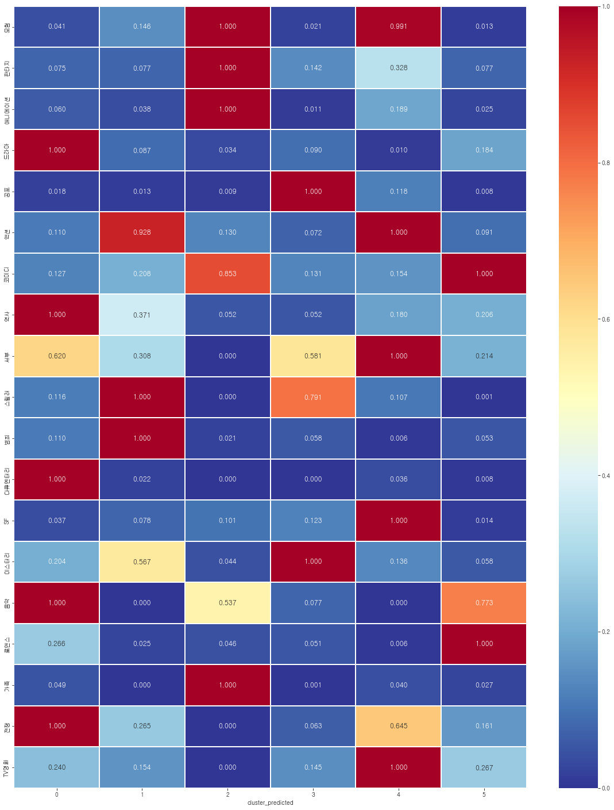

# EIVOM 이봄

## 영화인을 위한 추천 및 커뮤니티 웹사이트

#### 🤝SSAFY 상반기 최종 프로젝트 우수상


## EIVOM

MOVIE를 뒤집은 단어인 EIVOM 한국어로 이봄으로 발음되며,

- 좋아하는 영화에 대해 이야기 나누며 **깊이 봄**
- 크루 가입으로 나와 통하는 사람과 **같이 봄**

- 맞춤 추천으로 선호하는 장르의 영화를 **오롯이 봄**

이라는 의미를 담고 있습니다.

## 결과물 Preview

### 회원가입/로그인


### Signup Page

`아이디 비밀번호 설정 -> 개인프로필 설정 -> 선호장르 선택 순서`

##### 아이디 비밀번호 설정

- 아이디는 email형식으로 설정

##### 개인 프로필 설정

- 개인 프로필을 설정할 때 프로필이미지, 배경이미지, 닉네임, 생년월일, 자기소개, 성별, 지역을 설정
  - 프로필 이미지와 배경이미지는 로컬 이미지를 가져올 수 있음
- 생년월일은 date type을 이용하며, 성별과 지역은 dropbox형식을 이용한다.

##### 선호장르 선택

- 19개의 장르 중 선호하는 장르 3개 이상 선택
- 선택된 장르는 화면 하단에 표시되며, 다시 같은 버튼을 클릭하거나 하단의 선택된 장르의 버튼 클릭시 선택 해제


### Login Page

##### 로그인 시 인증 방식은 JWT 이용

- 로그인 을 하면 Token이 발급되고, 해당 토큰을 로컬스토리지에 저장해서 인증 기능 수행
- 로그인시 refresh Token 또한 발급받아, 로그아웃 시 이용 
- 로그아웃을 하면 로컬스토리지에서 토큰 삭제

### 프로필

#### 자신의 프로필과 좋아요 누른 영화 조회 가능


##### 구현 기능

-  해당 User의 이름, 프로필사진, 배경사진을 확인할 수 있음. 
-  해당 User가 Movie Detail Page에서 좋아요를 누른 영화를 확인할 수 있음.
-  영화 클릭 시 해당 영화 디테일 페이지로 넘어감


### 메인페이지(추천 리스트 구성)


##### 구현 기능 

`영화 추천 리스트 제공`

##### 박스오피스 상영 영화

- tmdb의 nowplaying api를 이용하여 현재 상영영화 목록을 보여줌


##### 영화 군집화 후 추천

- 군집분석을 통해 장르에 따라 영화를 5개 군집으로 나눈다.
- 군집 해석 후 군집에 따른 영화 추천 한다.
- 군집분석 결과
  - 군집 1 : 드라마, 역사, 다큐멘터리, 전쟁이 많은 영화 
    - **특성이 불분명하여 추천하지 않음**

  - 군집 2: 액션, 스릴러, 범죄 -> **카타르시스를 폭발시킬 영화**
  - 군집 3 : 모험, 판타지, 애니메이션, 가족 -> **동심을 되찾고 싶다면 이 영화 어때요?**
  - 군집 4 : 공포, 미스터리, 스릴러 - > **무더위 대비 등골 오싹해지는 영화**
  - 군집 5 : 모험, 액션, 서부, SF, TV 영화 -> 박**진감 넘치는 흥미진진한 영화**
  - 군집 6 : 코미디, 로맨스 음악 -> **순수하거나, 치명적이거나 달콤한 영화 **




##### 날씨 기반 영화 추천

- openweather사이트의 날씨 api를 사용하여 설정 지역의 날씨를 파악
- 해당 날씨에 맞춰 날씨별로 구성해놓은 영화 목록를 보여준다.


##### 최근 조회수가 높은 영화

- 최근 유저들이 많이 조회한 영화 리스트를 보여준다.
- 영화 디테일 페이지에 들어갈 때마다 조회수가 카운트되어 집계된다.
- 조회수가 높은 영화 50개 중 랜덤으로 10개의 영화 추천


##### TMDB 인기 영화

- tmdb의 popular movie api를 이용


##### 유저의 선호 장르 기반 추천 영화

- 회원가입 시 유저가 선택한 선호장르를 기반으로 해당 장르에 속하는 영화 50개를 인기도 순으로 조회 후, 10개의 영화를 랜덤으로 추천한다.

### 영화 상세 페이지/배우 상세 페이지 

- 영화의 상세 정보 조회
- 출연 배우 조회
  - 출연 배우 클릭시 배우의 필모그래피로 이동 
- 영화에 대한 리뷰 조회 및 생성/삭제 


#### Movie Detail Page

##### 구현 기능

- 선택한 영화의 상세정보 제공
- 영화에 대한 리뷰 기능 구현
  - 리뷰 생성, 수정, 삭제 기능
  - 별점 기능
  - 리뷰를 쓴 유저의 프로필 사진 클릭 시 해당 유저의 프로필 페이지로 이동
- 좋아요 한 영화에 담기 / 삭제 기능 구현
- 영화 주요 출연진 리스트 제공
  - 출연진 이미지 클릭 시 해당 출연진의 디테일 페이지로 이동

#### Actor Detail Page

##### 구현기능

- 선택한 출연진이 출연한 영화 정보 제공
- 영화 포스터 이미지 클릭 시 해당 영화의 디테일 페이지로 이동

### 검색기능

- 영화 검색 및 검색 결과로 이동


### 크루 페이지 (개발 진행중)

- 크루 가입, 게시글 작성 및 수정/삭제, 댓글 작성 및 수정/삭제 

 

#### Crew Page

##### 구현 기능

- 현재 등록된 크루 포스터와 크루 네임으로 크루 리스트 제공
- 새로운 크루 생성 기능
  - 크루 이미지, 배경이미지, 활동장소 설정
- 크루 포스터 클릭 시 해당 크루의 프로필 페이지로 이동

#### Crew Profile Page

##### 구현기능

- 크루의 상세정보 제공
- 크루 가입 / 탈퇴 기능 구현
- 게시글 생성 기능
- 게시글 조회 기능

#### Crew Article Page

##### 구현 기능

- 게시글의 수정 / 삭제 기능 구현
  - 수정 /  삭제는 게시글을 작성한 유저만 가능
- 게시글에 댓글 기능 구현


### 관리자 페이지

- 회원 정보 관리, 영화/리뷰 정보,크루 정보 갱신 가능 


- Django 기본 Admin page 이용 

## 개발환경

### 개발도구

- Python
- Django
- HTML/CSS
- JavaScript
- Vue.js

### 목표 설정

- 설정한 커밋 양식에 맞춰 깃 커밋하기
  - FEAT : 새로운 기능의 추가
  - FIX: 버그 수정
  - DOCS: 문서 수정
  - STYLE: 스타일 관련 기능(코드 포맷팅, 세미콜론 누락, 코드 자체의 변경이 없는 경우)
  - REFACTOR: 코드 리펙토링
  - TEST: 테스트 코트, 리펙토링 테스트 코드 추가
  - CHORE: 빌드 업무 수정, 패키지 매니저 수정(ex .gitignore 수정 같은 경우)
- 유저 친화적인 사이트 만들기
- 매일 아침 스크럼 회의 및 Todo list 만들기


### 프로토타입([FIGMA](https://www.figma.com/file/LKcLYFxgbjVYxKX8o2Amkq/EIVOM?node-id=15%3A33))


### ERD


- 주 모델 : 영화, 유저, 리뷰, 댓글, 장르, 크루
  - 1:N 참조 관계 
    - 영화-리뷰, 유저-리뷰, 유저-게시글, 게시글-댓글 
  - M:N 참조 관계
    - 영화-유저, 영화-장르, 크루-영화


### TMDB 에서 API 데이터 요청 후 json으로 저장하기  

1. 장르 받아오기
2. 인기영화 데이터 받아오기
   1. 데이터 별로 디테일 정보 받아오기
   2. 영화 ID를 기반으로 캐스트 정보 가져오기 
   3. 배우는 영어 이름 대신 as_known_as Name으로 이름 입력하기
3. JSON으로 저장 

```python
import json
import requests

def get_genre_datas() :
    BASE_URL = "https://api.themoviedb.org/3/genre/movie/list"
    total_genre = []

    request_url = f"{BASE_URL}?api_key={TMDB_API_KEY}&language=ko-KR"
    genres = requests.get(request_url).json()
    print(genres)
    print('-----------------------------')
    for genre in genres['genres'] :
        print(genre)
        fields = {
            'id' : genre['id'],
            'name' : genre['name']
        }
        print(fields)
        print('----------------------------------')
        data = {
            "pk" : genre['id'],
            "model" : "movies.Genre",
            "fields" : fields
        }
        print(data)
        print('------------------------------')
        total_genre.append(data)
        print(total_genre)
        print('------------------------------------------')
    with open("genre_data.json","w",encoding="utf-8") as w:
        json.dump(total_genre,w,indent="\t", ensure_ascii=False)

# get_genre_datas()
def get_movie_datas() :
    total_data_id = []
    total_movie_data = []
    BASE_URL = "https://api.themoviedb.org/3/movie/"
    BASE_URL2 = "https://api.themoviedb.org/3/person/"

    #1페이지부터 738페이지까지 popular movie 가져와서 id만 취하기 
    #501페이지부터는 에러가 발생해 500까지로 수정 
    # cnt = 0
    # for i in range(1,501) :
    #     cnt += 1 
    #     print(f'page_id:{cnt}')
    #     #popular 요청 
    #     request_url = f"{BASE_URL}popular?api_key={TMDB_API_KEY}&language=ko-KR&page={i}&region=KR"
    #     #movies에 저장 
    #     movies = requests.get(request_url).json()
    #     # print(movies)

    #     #result를 돌면서 id만 저장 
    #     for movie in movies['results'] :
    #         total_data_id.append(movie['id'])
    cnt = 0
    #total_data_id = [44632]
    #id들을 돌면서detail 정보 가져오기 
    for movie_id in total_data_id :
        cnt += 1 
        print(f'movie_detail:{cnt}')
        # detail 정보 요청할 url 
        request_url = f"{BASE_URL}{movie_id}?api_key={TMDB_API_KEY}&language=ko-KR"
        print(request_url)
        #json으로 가져와서 
        movie = requests.get(request_url).json()
        print(movie)
            #genre_id형태가 json이라 모델과 형식이 맞지 않아,id만 가져오기 위해 필드 따로 생성
        genre_ids = [] 
        
        for genre in movie['genres'] :
            genre_ids.append(genre['id'])
        print(genre_ids)
        fields = {
        'id' : movie['id'],
        'title' : movie['title'],
        'original_title' : movie['original_title'],
        'poster_path' : movie['poster_path'],
        'backdrop_path' : movie['backdrop_path'],
        'overview' : movie['overview'],
        'release_date' : movie['release_date'],
        'vote_count' : movie['vote_count'],
        'vote_average' : movie['vote_average'],
        'popularity' : movie['popularity'],
        'runtime' : movie['runtime'],
        'tagline' : movie['tagline'],
        'genres' :genre_ids,
        'director': '',
        'actor_id' : [],
        'actors': [],
        'actors_path' : [],

    }

        data = {
            "pk" : movie['id'],
            "model" : "movies.Movie",
            "fields" : fields
        }
        total_movie_data.append(data)
    # 영화 id를 가져와서 
    for data in total_movie_data :
        movie_id = data['fields']['id']
        #크레딧을 검색한다.
        credit_request_url = f"{BASE_URL}{movie_id}/credits?api_key={TMDB_API_KEY}&language=ko-KR"
        #크레딧 info를 불러오고 
        credit_info = requests.get(credit_request_url).json()
        #배우를 최대 15명까지로 넣기로하고, 해당 배우 목록들을 돌면서,
        for cast in credit_info['cast'][:15] :
            #id를 가져와서 
            cast_id = cast['id']
            print(cast_id)
            # 배우의 id로 디테일 정보에 접근한다.
            name_request_url = f"{BASE_URL2}{cast_id}?api_key={TMDB_API_KEY}&language=ko-KR"
            actor = requests.get(name_request_url).json()
            # 배우 id를 모델에 추가 
            data['fields']['actor_id'].append(cast_id)
            #배우에 잘 알려진 이름을 모델에 추가 
            if actor['also_known_as'] :
                data['fields']['actors'].append(actor['also_known_as'][0])
            else :
                data['fields']['actors'].append(cast['name'])
            #배우의 프로필사진을 모델에 추가 
            if actor['profile_path'] :
                data['fields']['actors_path'].append(actor['profile_path'])
            else :
                data['fields']['actors_path'].append('')
        #감독이름을 모델에 추가 
        if credit_info['crew']:
            data['director'] = credit_info['crew'][0]['name']
    
    with open("movie_data.json", "w", encoding="utf-8") as w:
        json.dump(total_movie_data, w, indent="\t", ensure_ascii=False)
        
get_genre_datas()
get_movie_datas()
```


## 서버 URL 명세

### [URL](https://github.com/holawan/EIVOM/blob/master/final-pjt-back/URL.md)
